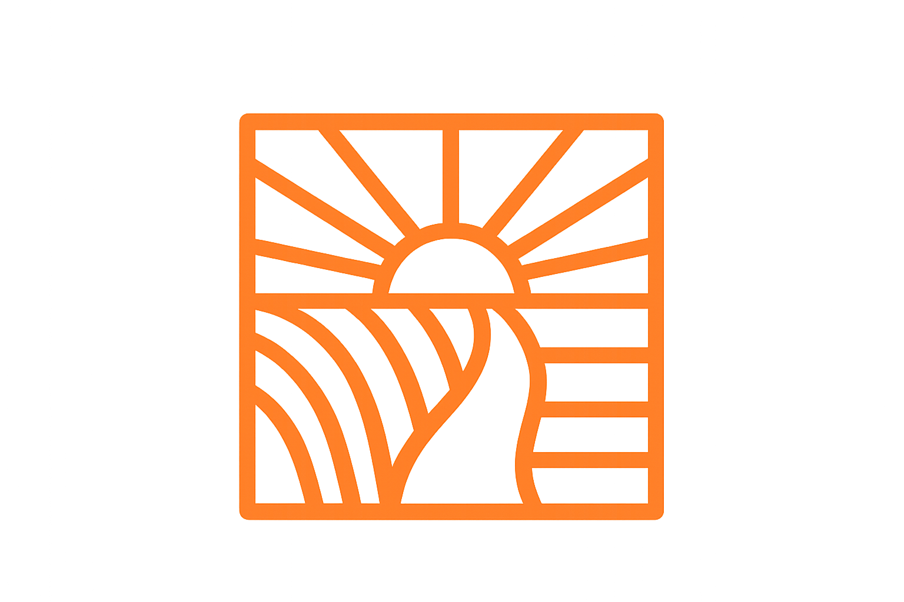

# 🧩 Библиотека компонентов

Справочник по всем UI компонентам, используемым в статической копии.

## 📋 Содержание
- [Кнопки](#кнопки)
- [Карточки](#карточки)
- [Формы](#формы)
- [Навигация](#навигация)
- [Типографика](#типографика)
- [Иконки](#иконки)
- [Анимации](#анимации)
- [Утилиты](#утилиты)

---

## 🔘 Кнопки

### Основная кнопка (Luxury)
```html
<a href="#" class="btn-luxury">
  <i class="bi bi-calendar-plus"></i>
  Забронировать
</a>
```
**Стили**: Оранжевый градиент, тень, hover эффект

### Вторичная кнопка (Outline)
```html
<a href="#" class="btn-luxury-outline">
  <i class="bi bi-info-circle"></i>
  Подробнее
</a>
```
**Стили**: Прозрачный фон, рамка, hover заливка

### Маленькая золотая кнопка
```html
<a href="#" class="btn-gold-sm">
  Подробнее <i class="bi bi-arrow-right"></i>
</a>
```
**Стили**: Компактная, светлый фон, золотой текст

### Кнопка отправки формы
```html
<button type="submit" class="btn-submit">
  <i class="bi bi-send"></i>
  Отправить сообщение
</button>
```
**Стили**: Полная ширина, градиент, анимация

---

## 🃏 Карточки

### Карточка номера
```html
<article class="room-card">
  <div class="room-img-wrap">
    
    <span class="img-badge img-badge-cat">Стандарт</span>
    <span class="avail-badge avail-free">
      <span class="avail-dot avail-dot-free"></span>
      Свободно 5
    </span>
  </div>
  <div class="room-card-body">
    <a href="#" class="room-name">Стандартный номер</a>
    <p class="room-desc">Уютный номер с видом на город</p>
    <div class="room-specs">
      <span class="room-spec">
        <i class="bi bi-people"></i>2 гост.
      </span>
      <span class="room-spec">
        <i class="bi bi-aspect-ratio"></i>25 м²
      </span>
    </div>
    <div class="amenity-chips">
      <span class="amenity-chip">
        <i class="bi bi-wifi"></i>Wi-Fi
      </span>
    </div>
    <div class="room-footer">
      <div>
        <div class="room-price">3500 ₽</div>
        <div class="room-price-label">за ночь</div>
      </div>
      <a href="#" class="btn-gold-sm">Подробнее</a>
    </div>
  </div>
</article>
```

### Карточка контента
```html
<div class="content-card">
  <h2>Заголовок</h2>
  <p>Текст карточки с описанием</p>
</div>
```

### Карточка функции
```html
<div class="feature-card">
  <div class="feature-icon-wrap">
    <i class="bi bi-wifi"></i>
  </div>
  <div class="feature-title">Бесплатный Wi-Fi</div>
  <p class="feature-desc">Высокоскоростной интернет во всех номерах</p>
</div>
```

---

## 📝 Формы

### Поле ввода
```html
<div class="mb-3">
  <label for="name" class="form-field-label">
    <i class="bi bi-person me-1"></i>Ваше имя
  </label>
  <input type="text" 
         id="name" 
         class="lux-input form-control" 
         placeholder="Иван Иванов">
</div>
```

### Текстовое поле
```html
<div class="mb-3">
  <label for="message" class="form-field-label">
    <i class="bi bi-pencil me-1"></i>Сообщение
  </label>
  <textarea id="message" 
            class="lux-input form-control" 
            rows="5" 
            placeholder="Ваше сообщение"></textarea>
</div>
```

### Выбор даты
```html
<div class="search-field-group">
  <label class="search-field-label">
    <i class="bi bi-calendar-check me-1"></i>Дата заезда
  </label>
  <input type="date" class="form-control lux-input">
</div>
```

### Чекбокс
```html
<div class="form-check">
  <input type="checkbox" 
         class="form-check-input" 
         id="agree">
  <label class="form-check-label" for="agree">
    Согласен с условиями
  </label>
</div>
```

---

## 🧭 Навигация

### Навбар (Header)
```html
<nav id="navbar" style="...">
  <div style="...">
    <!-- Логотип -->
    <a href="index.html" class="navbar-logo-v2">
      
      <span>Зори<span style="color: #E8700A;">Ваха</span></span>
    </a>
    
    <!-- Навигация -->
    <ul id="navLinks" class="nav-links-desktop">
      <li><a href="index.html" class="nav-link-item">Главная</a></li>
      <li><a href="pages/rooms.html" class="nav-link-item">Номера</a></li>
      <li><a href="pages/about.html" class="nav-link-item">О нас</a></li>
    </ul>
    
    <!-- Кнопки -->
    <div style="...">
      <a href="#" class="btn">Войти</a>
    </div>
  </div>
</nav>
```

### Хлебные крошки
```html
<nav class="breadcrumb-lux" aria-label="Навигация">
  <a href="index.html">
    <i class="bi bi-house"></i> Главная
  </a>
  <span class="sep">/</span>
  <a href="pages/rooms.html">Номера</a>
  <span class="sep">/</span>
  <span class="current">Стандарт</span>
</nav>
```

### Футер
```html
<footer style="...">
  <div style="...">
    <div style="display:grid;grid-template-columns:1.5fr 1fr 1fr 1fr;...">
      <!-- Бренд -->
      <div>
        <a href="index.html">Зори<span>Ваха</span></a>
        <p>Описание гостиницы</p>
      </div>
      
      <!-- Навигация -->
      <div>
        <h5>Навигация</h5>
        <ul>
          <li><a href="index.html">Главная</a></li>
        </ul>
      </div>
    </div>
  </div>
</footer>
```

---

## ✍️ Типографика

### Заголовки страниц
```html
<h1 class="page-hero-title">
  Добро пожаловать в <em>Зори Ваха</em>
</h1>
```

### Заголовки секций
```html
<h2 class="section-heading">
  Выберите <em>идеальный</em> номер
</h2>
```

### Подзаголовок секции
```html
<p class="section-lead">
  Каждый номер — это отдельная история комфорта
</p>
```

### Eyebrow (надзаголовок)
```html
<div class="eyebrow">
  <i class="bi bi-stars"></i>
  Уютная гостиница
</div>
```

### Золотой разделитель
```html
<div class="gold-divider">
  <i class="bi bi-gem"></i>
</div>
```

---

## 🎨 Иконки

Используются **Bootstrap Icons**:

```html
<!-- Основные -->
<i class="bi bi-house"></i>          <!-- Дом -->
<i class="bi bi-door-open"></i>      <!-- Дверь -->
<i class="bi bi-calendar-check"></i> <!-- Календарь -->
<i class="bi bi-people"></i>         <!-- Люди -->
<i class="bi bi-telephone"></i>      <!-- Телефон -->
<i class="bi bi-envelope"></i>       <!-- Email -->
<i class="bi bi-geo-alt"></i>        <!-- Локация -->
<i class="bi bi-wifi"></i>           <!-- Wi-Fi -->
<i class="bi bi-star-fill"></i>      <!-- Звезда -->
<i class="bi bi-arrow-right"></i>    <!-- Стрелка -->
<i class="bi bi-search"></i>         <!-- Поиск -->
<i class="bi bi-x-lg"></i>           <!-- Закрыть -->
```

Полный список: https://icons.getbootstrap.com/

---

## 🎬 Анимации

### Появление при скролле
```html
<div class="reveal">
  <!-- Контент появится при прокрутке -->
</div>
```

### Fade Up с задержкой
```html
<div class="anim-fade-up anim-delay-1">
  <!-- Появится с задержкой 0.1s -->
</div>
```

### Плавающий элемент
```css
.floating {
  animation: float 7s ease-in-out infinite;
}
```

### Пульсация
```css
.pulse {
  animation: pulse-gold 2s infinite;
}
```

### Мерцание текста
```html
<span class="text-shimmer">Золотой текст</span>
```

---

## 🛠️ Утилиты

### Цвета
```html
<span class="text-gold">Золотой текст</span>
<div class="bg-dark-card">Темный фон</div>
<div class="border-gold">Золотая рамка</div>
```

### Отступы
```html
<div class="mb-3">Отступ снизу</div>
<div class="mt-5">Отступ сверху</div>
<div class="py-4">Вертикальные отступы</div>
```

### Выравнивание
```html
<div class="text-center">По центру</div>
<div class="d-flex justify-content-between">Flex</div>
```

### Адаптивность
```html
<div class="col-12 col-md-6 col-lg-4">
  <!-- 12 колонок на мобильном, 6 на планшете, 4 на десктопе -->
</div>
```

### Видимость
```html
<div class="d-none d-md-block">
  <!-- Скрыто на мобильном, видно на планшете+ -->
</div>
```

---

## 📊 Бейджи и метки

### Статус доступности
```html
<span class="avail-badge avail-free">
  <span class="avail-dot avail-dot-free"></span>
  Свободно 5
</span>

<span class="avail-badge avail-busy">
  <span class="avail-dot avail-dot-busy"></span>
  Занято
</span>
```

### Метка категории
```html
<span class="img-badge img-badge-cat">Стандарт</span>
```

### Чип удобства
```html
<span class="amenity-chip">
  <i class="bi bi-wifi"></i>Wi-Fi
</span>
```

### Тег секции
```html
<span class="section-tag">Новинка</span>
```

---

## 🎯 Специальные компоненты

### Карточка цены
```html
<div class="price-box">
  <div class="price-main">3500 ₽</div>
  <div class="price-label">за ночь</div>
  <div class="price-weekend">
    <span class="price-weekend-label">Выходные</span>
    <span class="price-weekend-value">4200 ₽</span>
  </div>
</div>
```

### Спецификации номера
```html
<div class="specs-grid">
  <div class="spec-item">
    <div class="spec-icon"><i class="bi bi-people"></i></div>
    <div>
      <div class="spec-label">Вместимость</div>
      <div class="spec-value">2 гост.</div>
    </div>
  </div>
</div>
```

### Галерея с превью
```html
<div class="gallery-thumbs">
  <button class="gallery-thumb active" data-src="img1.jpg">
    
  </button>
  <button class="gallery-thumb" data-src="img2.jpg">
    
  </button>
</div>
```

### Отзыв
```html
<div class="review-item">
  <div class="review-header">
    <div>
      <div class="review-author">Иван Иванов</div>
      <div class="review-date">01.05.2026</div>
    </div>
    <div class="review-stars">
      <i class="bi bi-star-fill"></i>
      <i class="bi bi-star-fill"></i>
      <i class="bi bi-star-fill"></i>
      <i class="bi bi-star-fill"></i>
      <i class="bi bi-star-fill"></i>
    </div>
  </div>
  <p class="review-body">Отличный номер, всё понравилось!</p>
</div>
```

---

## 🎨 Цветовая палитра

```css
/* Основные цвета */
--background:    #eff0f3  /* Светлый фон */
--headline:      #0d0d0d  /* Черный текст */
--paragraph:     #2a2a2a  /* Темно-серый текст */
--button:        #ff8e3c  /* Оранжевый (primary) */
--secondary:     #ffffff  /* Белый */
--tertiary:      #d9376e  /* Розовый */

/* Оттенки primary */
--primary-light: #ffb380  /* Светлый оранжевый */
--primary-dark:  #e67a2a  /* Темный оранжевый */
--primary-dim:   rgba(255,142,60,.12)  /* Прозрачный */
--primary-border:rgba(255,142,60,.25)  /* Рамка */

/* Текст */
--text-muted:    rgba(13,13,13,.6)   /* Приглушенный */
--text-faint:    rgba(13,13,13,.35)  /* Очень светлый */

/* Границы */
--border-subtle: rgba(13,13,13,.1)   /* Тонкая граница */
```

---

## 📐 Размеры и отступы

```css
/* Радиусы */
--radius-xs:  6px
--radius-sm:  10px
--radius-md:  16px
--radius-lg:  24px
--radius-xl:  32px

/* Тени */
--shadow-sm:  0 2px 8px rgba(13,13,13,.08)
--shadow-md:  0 4px 16px rgba(13,13,13,.12)
--shadow-lg:  0 8px 32px rgba(13,13,13,.16)
--shadow-primary: 0 4px 20px rgba(255,142,60,.25)

/* Переходы */
--ease-out:   cubic-bezier(.16,1,.3,1)
--ease-in-out:cubic-bezier(.4,0,.2,1)
```

---

## 💡 Советы по использованию

1. **Комбинируйте классы** - используйте Bootstrap утилиты вместе с кастомными классами
2. **Следуйте иерархии** - используйте правильные теги (h1-h6, article, section)
3. **Добавляйте ARIA** - для доступности (aria-label, role)
4. **Оптимизируйте изображения** - используйте loading="lazy"
5. **Тестируйте адаптивность** - проверяйте на разных устройствах

---

**Обновлено**: 2026-05-08  
**Версия**: 1.0.0
