# ER-диаграмма базы данных системы управления гостиницей

## Диаграмма связей

```mermaid
erDiagram
    %% ============================================
    %% ACCOUNTS (Пользователи и роли)
    %% ============================================
    User {
        int id PK
        string email UK "Уникальный email"
        string password
        string role "user|receptionist|manager|admin|super_admin"
        string first_name
        string last_name
        string phone
        date date_of_birth
        string avatar
        string passport_series
        string passport_number
        string passport_issued_by
        date passport_issued_date
        string preferred_language
        boolean marketing_consent
        boolean email_notifications
        boolean is_active
        boolean is_staff
        boolean is_superuser
        datetime created_at
        datetime updated_at
    }

    %% ============================================
    %% HOTEL (Номера и категории)
    %% ============================================
    Amenity {
        int id PK
        string name UK
        string icon
        string category "comfort|tech|food|wellness|service"
        boolean is_highlighted
        int sort_order
        datetime created_at
        datetime updated_at
    }

    RoomCategory {
        int id PK
        string name UK
        string slug UK
        text description
        string short_description
        int max_guests
        string bed_type "single|double|twin|king|bunk"
        int area_sqm
        decimal base_price_per_night
        decimal weekend_price_per_night
        string thumbnail
        boolean is_active
        boolean is_featured
        int sort_order
        datetime created_at
        datetime updated_at
    }

    RoomImage {
        int id PK
        int category_id FK
        string image
        string caption
        string alt_text
        boolean is_primary
        int sort_order
        datetime created_at
        datetime updated_at
    }

    Room {
        int id PK
        int category_id FK
        string number
        string subdivision "а, б, в"
        int floor
        int max_guests_per_room
        string status "available|occupied|maintenance|cleaning|blocked"
        boolean has_balcony
        boolean has_sea_view
        boolean has_mountain_view
        text notes
        datetime last_cleaned_at
        datetime created_at
        datetime updated_at
    }

    SeasonalPrice {
        int id PK
        int category_id FK
        string name
        date start_date
        date end_date
        decimal price_per_night
        int min_nights
        datetime created_at
        datetime updated_at
    }

    RoomReview {
        int id PK
        int category_id FK
        int guest_id FK
        int booking_id FK "OneToOne"
        int rating "1-5"
        int cleanliness_rating
        int service_rating
        int comfort_rating
        string title
        text body
        boolean is_approved
        int approved_by_id FK
        datetime approved_at
        datetime created_at
        datetime updated_at
    }

    %% ============================================
    %% BOOKINGS (Бронирования)
    %% ============================================
    Booking {
        uuid id PK
        string confirmation_number UK "ZV-XXXXXXXX"
        int guest_id FK
        int room_category_id FK
        int room_id FK "Назначается при заселении"
        uuid group_id "Группа броней"
        int organization_id FK
        string guest_first_name
        string guest_last_name
        string guest_patronymic
        string guest_phone
        string guest_email
        date check_in
        date check_out
        int adults
        int children
        string occupancy_type "solo|newlyweds|friends|two_guests"
        decimal price_per_night
        decimal total_price
        decimal discount_amount
        string discount_reason
        string status "pending|confirmed|checked_in|checked_out|cancelled|no_show"
        string payment_status "unpaid|partial|paid|refunded|failed"
        string source "website|phone|walk_in|ota|corporate"
        datetime auto_cancel_at
        text special_requests
        time arrival_time
        time departure_time
        boolean early_check_in
        text internal_notes
        int created_by_id FK
        datetime cancelled_at
        text cancellation_reason
        int cancelled_by_id FK
        datetime created_at
        datetime updated_at
    }

    BookingHistory {
        int id PK
        int booking_id FK
        string action "created|confirmed|checked_in|checked_out|cancelled|no_show|payment|note_added|modified|undo_check_in|undo_check_out"
        string status_after
        int changed_by_id FK
        text note
        json snapshot
        datetime created_at
    }

    Payment {
        uuid id PK
        int booking_id FK
        decimal amount
        string method "cash|card|transfer|online"
        string payment_type "charge|refund"
        string transaction_id
        boolean is_confirmed
        datetime confirmed_at
        int processed_by_id FK
        text notes
        datetime created_at
        datetime updated_at
    }

    %% ============================================
    %% CRM (Управление клиентами)
    %% ============================================
    Organization {
        int id PK
        string name UK
        string short_name
        string org_type "company|government|ngo|individual"
        string inn
        string kpp
        string ogrn
        text legal_address
        text actual_address
        string phone
        string email
        string website
        string contact_person
        decimal corporate_discount_pct
        decimal credit_limit
        int payment_terms_days
        int assigned_manager_id FK
        text notes
        boolean is_active
        boolean is_approved
        int created_by_user_id FK
        datetime created_at
        datetime updated_at
    }

    ClientProfile {
        int id PK
        int user_id FK "OneToOne"
        int organization_id FK
        string client_type "individual|organization"
        string guest_type "leisure|business|corporate|vip"
        string status "active|vip|inactive|blacklisted"
        string loyalty_tier "standard|silver|gold|platinum"
        int loyalty_points
        int total_stays
        int total_nights
        decimal total_spent
        date first_stay_date
        date last_stay_date
        int preferred_room_category_id FK
        int preferred_floor
        string dietary_requirements
        text special_needs
        int assigned_manager_id FK
        text vip_notes
        boolean is_blacklisted
        text blacklist_reason
        datetime created_at
        datetime updated_at
    }

    AdminComment {
        int id PK
        int client_id FK
        int author_id FK
        text body
        boolean is_pinned
        datetime created_at
        datetime updated_at
    }

    Interaction {
        int id PK
        int client_id FK
        int staff_id FK
        int booking_id FK
        string interaction_type "call|email|in_person|chat|note|complaint"
        string subject
        text body
        string outcome
        boolean is_resolved
        date follow_up_date
        datetime created_at
        datetime updated_at
    }

    Task {
        int id PK
        string title
        text description
        int created_by_id FK
        int assigned_to_id FK
        int client_id FK
        int booking_id FK
        string priority "low|medium|high|urgent"
        string status "open|in_progress|done|cancelled"
        date due_date
        datetime completed_at
        datetime created_at
        datetime updated_at
    }

    Message {
        int id PK
        int sender_id FK
        int recipient_id FK
        int booking_id FK
        int client_profile_id FK
        string message_type "inquiry|complaint|request|feedback|internal"
        string subject
        text body
        string attachment
        int parent_id FK "Ответ на сообщение"
        string status "unread|read|replied|archived"
        datetime read_at
        boolean is_urgent
        datetime created_at
        datetime updated_at
    }

    %% ============================================
    %% ANALYTICS (Аналитика)
    %% ============================================
    DailyMetrics {
        int id PK
        date date UK
        int total_rooms
        int occupied_rooms
        int available_rooms
        decimal occupancy_rate
        decimal total_revenue
        decimal adr "Average Daily Rate"
        decimal revpar "Revenue Per Available Room"
        int new_bookings
        int confirmed_bookings
        int cancelled_bookings
        int checkins
        int checkouts
        int no_shows
        int total_guests
        int new_guests
        datetime calculated_at
    }

    PageView {
        int id PK
        string page_type "home|room_list|room_detail|booking_form|booking_success|about|contacts|other"
        string path
        string referrer
        int user_id FK
        string session_key
        string ip_address
        string user_agent
        int room_category_id FK
        datetime viewed_at
    }

    BookingFunnel {
        int id PK
        string session_key
        int user_id FK
        string stage "search|room_view|form_open|form_submit|success|abandoned"
        int room_category_id FK
        int booking_id FK
        date search_check_in
        date search_check_out
        int search_guests
        datetime started_at
        datetime updated_at
    }

    RevenueSnapshot {
        int id PK
        int year
        int month
        decimal total_revenue
        int total_bookings
        int total_nights
        decimal avg_occupancy
        decimal avg_adr
        datetime calculated_at
    }

    %% ============================================
    %% NOTIFICATIONS (Уведомления)
    %% ============================================
    EmailLog {
        int id PK
        string recipient_email
        string recipient_name
        int recipient_user_id FK
        string email_type "booking_confirmation|booking_cancelled|booking_reminder|booking_checkout|password_reset|welcome|marketing|custom"
        string subject
        text body_html
        text body_text
        int booking_id FK
        string status "pending|sent|failed|bounced"
        datetime sent_at
        text error_message
        int retry_count
        string task_id
        datetime created_at
        datetime updated_at
    }

    NotificationTemplate {
        int id PK
        string email_type UK
        string name
        string subject
        text body_html
        text body_text
        boolean is_active
        int updated_by_id FK
        datetime created_at
        datetime updated_at
    }

    PushNotification {
        int id PK
        int recipient_id FK
        string notification_type "booking_confirmed|booking_cancelled|checkin_reminder|checkout_reminder|loyalty_upgrade|contact_form|system"
        string title
        text body
        string action_url
        int booking_id FK
        boolean is_read
        datetime read_at
        datetime created_at
        datetime updated_at
    }

    ContactMessage {
        int id PK
        int sender_user_id FK
        string sender_name
        string sender_email
        string sender_phone
        string subject
        text message
        string status "new|in_work|answered|closed"
        int assigned_to_id FK
        datetime created_at
        datetime updated_at
    }

    ContactReply {
        int id PK
        int message_id FK
        int author_id FK
        text body
        boolean is_staff_reply
        boolean is_read_by_guest
        datetime created_at
        datetime updated_at
    }

    %% ============================================
    %% CONTENT (Контент сайта)
    %% ============================================
    SiteContent {
        int id PK
        string key UK
        string label
        string content_type "text|html|image|url"
        text value_text
        string value_image
        boolean is_active
        int updated_by_id FK
        datetime created_at
        datetime updated_at
    }

    FAQ {
        int id PK
        string question
        text answer
        string category "booking|checkin|services|payment|general"
        boolean is_active
        int sort_order
        datetime created_at
        datetime updated_at
    }

    HotelGallery {
        int id PK
        string image
        string title
        string alt_text
        string section "exterior|lobby|restaurant|spa|pool|conference|territory|other"
        boolean is_active
        boolean is_featured
        int sort_order
        datetime created_at
        datetime updated_at
    }

    Testimonial {
        int id PK
        int user_id FK
        string author_name
        string author_title
        string author_avatar
        text text
        int rating "1-5"
        boolean is_active
        string source
        int sort_order
        datetime created_at
        datetime updated_at
    }

    %% ============================================
    %% СВЯЗИ (Relationships)
    %% ============================================

    %% User relationships
    User ||--o{ Booking : "guest"
    User ||--o{ Booking : "created_by"
    User ||--o{ Booking : "cancelled_by"
    User ||--o{ BookingHistory : "changed_by"
    User ||--o{ Payment : "processed_by"
    User ||--o{ RoomReview : "guest"
    User ||--o{ RoomReview : "approved_by"
    User ||--|| ClientProfile : "user"
    User ||--o{ Organization : "assigned_manager"
    User ||--o{ Organization : "created_by_user"
    User ||--o{ ClientProfile : "assigned_manager"
    User ||--o{ AdminComment : "author"
    User ||--o{ Interaction : "staff"
    User ||--o{ Task : "created_by"
    User ||--o{ Task : "assigned_to"
    User ||--o{ Message : "sender"
    User ||--o{ Message : "recipient"
    User ||--o{ EmailLog : "recipient_user"
    User ||--o{ NotificationTemplate : "updated_by"
    User ||--o{ PushNotification : "recipient"
    User ||--o{ ContactMessage : "sender_user"
    User ||--o{ ContactMessage : "assigned_to"
    User ||--o{ ContactReply : "author"
    User ||--o{ SiteContent : "updated_by"
    User ||--o{ Testimonial : "user"
    User ||--o{ PageView : "user"
    User ||--o{ BookingFunnel : "user"

    %% Hotel relationships
    RoomCategory ||--o{ RoomImage : "category"
    RoomCategory ||--o{ Room : "category"
    RoomCategory ||--o{ SeasonalPrice : "category"
    RoomCategory ||--o{ RoomReview : "category"
    RoomCategory ||--o{ Booking : "room_category"
    RoomCategory ||--o{ ClientProfile : "preferred_room_category"
    RoomCategory ||--o{ PageView : "room_category"
    RoomCategory ||--o{ BookingFunnel : "room_category"
    RoomCategory }o--o{ Amenity : "amenities (M2M)"
    Room }o--o{ Amenity : "extra_amenities (M2M)"
    Room ||--o{ Booking : "room"

    %% Booking relationships
    Booking ||--o{ BookingHistory : "booking"
    Booking ||--o{ Payment : "booking"
    Booking ||--|| RoomReview : "booking"
    Booking ||--o{ Interaction : "booking"
    Booking ||--o{ Task : "booking"
    Booking ||--o{ Message : "booking"
    Booking ||--o{ EmailLog : "booking"
    Booking ||--o{ PushNotification : "booking"
    Booking ||--o{ BookingFunnel : "booking"

    %% CRM relationships
    Organization ||--o{ ClientProfile : "organization"
    Organization ||--o{ Booking : "organization"
    ClientProfile ||--o{ AdminComment : "client"
    ClientProfile ||--o{ Interaction : "client"
    ClientProfile ||--o{ Task : "client"
    ClientProfile ||--o{ Message : "client_profile"

    %% Message relationships
    Message ||--o{ Message : "parent (self-reference)"
    ContactMessage ||--o{ ContactReply : "message"
```

## Описание основных сущностей

### 1. **Модуль Accounts (Пользователи)**
- **User** — расширенная модель пользователя с ролями (user, receptionist, manager, admin, super_admin)
- Хранит личные данные, паспортные данные, настройки уведомлений

### 2. **Модуль Hotel (Гостиница)**
- **Amenity** — удобства (Wi-Fi, кондиционер, мини-бар и т.д.)
- **RoomCategory** — категории номеров (Стандарт, Делюкс, Люкс)
- **Room** — физические номера с поддержкой подразделений (303а, 303б)
- **RoomImage** — галерея фотографий категорий
- **SeasonalPrice** — сезонные цены для категорий
- **RoomReview** — отзывы гостей о номерах

### 3. **Модуль Bookings (Бронирования)**
- **Booking** — основная запись бронирования с UUID
- **BookingHistory** — иммутабельный аудит-лог всех изменений
- **Payment** — платежи (поддержка частичной оплаты)
- Жизненный цикл: pending → confirmed → checked_in → checked_out

### 4. **Модуль CRM (Управление клиентами)**
- **Organization** — корпоративные клиенты
- **ClientProfile** — расширенный профиль гостя (1:1 с User)
- **AdminComment** — комментарии персонала к профилю
- **Interaction** — лог всех контактов с гостем
- **Task** — задачи для сотрудников
- **Message** — внутренние сообщения

### 5. **Модуль Analytics (Аналитика)**
- **DailyMetrics** — ежедневные метрики (загрузка, выручка, ADR, RevPAR)
- **PageView** — просмотры страниц
- **BookingFunnel** — воронка бронирования
- **RevenueSnapshot** — ежемесячные снимки выручки

### 6. **Модуль Notifications (Уведомления)**
- **EmailLog** — полный лог всех отправленных писем
- **NotificationTemplate** — редактируемые шаблоны писем
- **PushNotification** — внутренние уведомления в личном кабинете
- **ContactMessage** — сообщения с формы обратной связи
- **ContactReply** — ответы на обращения

### 7. **Модуль Content (Контент)**
- **SiteContent** — редактируемые текстовые блоки (CMS-lite)
- **FAQ** — часто задаваемые вопросы
- **HotelGallery** — общая галерея гостиницы
- **Testimonial** — отзывы на главной странице

## Ключевые особенности архитектуры

1. **UUID для Booking** — безопасное использование в URL и email
2. **Иммутабельные логи** — BookingHistory, EmailLog (append-only)
3. **Поддержка множественного размещения** — Room.max_guests_per_room
4. **Иерархия ролей** — от user до super_admin
5. **Система лояльности** — автоматическое повышение уровня
6. **Аналитика в реальном времени** — DailyMetrics, воронка продаж
7. **Гибкое ценообразование** — базовые, выходные и сезонные цены
8. **Полный аудит** — все изменения логируются с указанием автора

## Индексы и ограничения

- Уникальные индексы: email, confirmation_number, room number+subdivision
- Составные индексы для частых запросов (status+date, guest+status)
- Check constraints: check_out > check_in, adults >= 1
- Foreign keys с PROTECT/SET_NULL для сохранения истории
